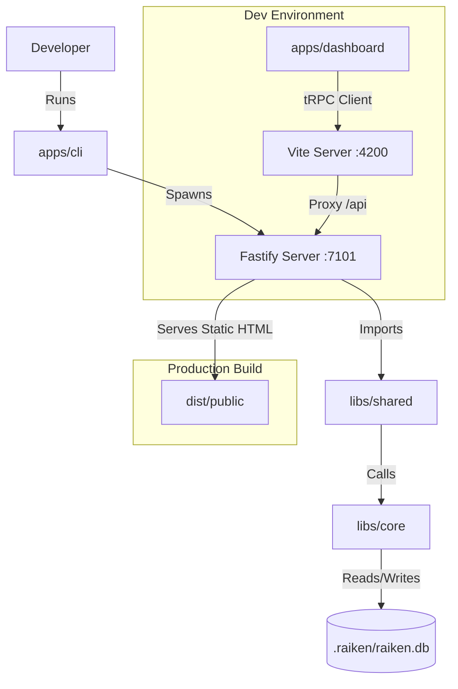

# Raiken

Raiken is a developer-centric CLI tool that automates the generation, execution, and repair of End-to-End (E2E) tests. Unlike stateless AI wrappers, Raiken maintains local state using a SQLite database to understand project evolution over time.

## 🏗 System Architecture

Raiken is built as an **Nx Integrated Monorepo**. It separates the "Runner" (CLI) from the "Logic" (Core) and the "Interface" (Dashboard).

### The 4 Pillars

| **Module**             | **Location**     | **Description**                                                   | **Tech Stack**                        |
| :--------------------- | :--------------- | :---------------------------------------------------------------- | :------------------------------------ |
| **CLI (The Runner)**   | `apps/cli`       | The Node.js binary. Spawns the server and orchestrates the agent. | Fastify, Commander, Node.js           |
| **Dashboard (The UI)** | `apps/dashboard` | The visual interface. Communicates with CLI via tRPC.             | React, Vite, Tailwind, TanStack Query |
| **Core (The Logic)**   | `libs/core`      | The "Brain". Handles DB, AST parsing, and Embeddings.             | SQLite-vec, Transformers.js, Babel    |
| **Shared (The Contract)** | `libs/shared` | Shared tRPC Router & Types. Ensures Type Safety between CLI & UI. | tRPC, Zod                             |

### Data Flow Diagram



## 🚀 Getting Started

### Prerequisites

- **Node.js**: v22.x (see `.nvmrc`)
- **pnpm**: v10.x (see root `packageManager`; install with `corepack enable`)

### Installation

1. **Clone the repository**
   ```bash
   git clone https://github.com/Raiken-Foundation/raiken-app.git
   cd raiken-app
   ```

2. **Install dependencies**
   ```bash
   pnpm install
   ```

   This will install all dependencies for the monorepo, including:
   - Root workspace dependencies
   - CLI app dependencies (`apps/cli`)
   - Dashboard app dependencies (`apps/dashboard`)
   - All library dependencies (`libs/*`)

### Running the Project

#### Development Mode (Recommended)

> **Important:** During development, you MUST run both servers. The CLI serves the API, and Vite serves the dashboard with hot reload. In production, the CLI serves everything.

Run the backend and frontend in **two separate terminals**:

**Terminal 1 - Backend (Fastify Server)**
```bash
nx serve cli
```
- Starts Fastify server on `http://localhost:7101`
- Serves tRPC API at `/api/trpc`
- Rebuild/restart the CLI after backend changes; the current server target does not watch files

**Terminal 2 - Frontend (React Dashboard)**
```bash
nx serve dashboard
```
- Starts Vite dev server on `http://localhost:4200`
- Proxies `/api` requests to backend (port 7101)
- Hot Module Replacement (HMR) enabled
- **Open your browser to `http://localhost:4200`**

#### Production Build

1. **Build all projects**
   ```bash
   nx run-many -t build
   ```

2. **Build CLI only** (includes dashboard as static assets)
   ```bash
   nx build cli
   ```

3. **Install the built CLI globally**
   ```bash
   pnpm run cli:install
   ```
   The build installs production dependencies into the distribution directory;
   this command then links that packaged CLI globally through pnpm.

4. **Run the built CLI**
   ```bash
   node dist/apps/cli/bin.cjs start
   ```
   - Serves both API and dashboard on `http://localhost:7101`

### CLI Commands

After installing and building Raiken, these commands are available:

```bash
raiken start [options]         # Start the Raiken dashboard and agent server
  -p, --port <number>          # Port to run on (default: 7101)

raiken init [options]          # Initialize Raiken in the current project
  -f, --force                  # Overwrite existing configuration files

raiken discover [url] [options]  # Autonomously discover web application structure
  --max-pages <number>         # Maximum pages to discover (default: 100)
  --max-depth <number>         # Maximum navigation depth (default: 5)
  --timeout <number>           # Timeout per page in ms (default: 30000)
  --auth                       # Prompt for authentication before discovery
  --skip-auth                  # Skip authentication-required routes
  --continue                   # Resume a paused discovery session
  --status                     # Show discovery statistics

raiken auth [options]          # Authenticate to save browser session state
  --url <url>                  # URL to navigate to for authentication
  --script <path>              # Run a project-local custom login script
  --manual                     # Ignore configured script; use an interactive browser
  --headed                     # Show the scripted-login browser
  --timeout <ms>               # Script timeout
```

### Configuration

Raiken is configured via `raiken.config.json` in your project root (created by `raiken init`). All fields are optional.

```json
{
  "projectType": "react",
  "testDirectory": "e2e",
  "playwrightConfig": "playwright.config.ts",
  "ai": {
    "provider": "openrouter",
    "model": "anthropic/claude-sonnet-4.5",
    "baseURL": "https://openrouter.ai/api/v1",
    "maxTokens": 4000,
    "temperature": 0.7
  },
  "auth": {
    "storageStatePath": ".raiken/auth-state.json",
    "baseUrl": "http://localhost:3000",
    "loginPath": "/login",
    "customLoginScript": "e2e/auth/login.ts",
    "credentials": {
      "usernameEnv": "E2E_USERNAME",
      "passwordEnv": "E2E_PASSWORD"
    }
  },
  "browser": {
    "defaultBrowser": "chromium",
    "headless": true,
    "timeout": 30000,
    "retries": 1
  },
  "features": {
    "video": true,
    "screenshots": true,
    "tracing": false,
    "network": true
  },
  "autonomy": {
    "autoSaveTests": false,
    "autoRunTests": false,
    "autoCorrect": "suggest",
    "autoLearn": "confirm",
    "maxRetries": 2
  },
  "discovery": {
    "maxPages": 100,
    "maxDepth": 5,
    "maxConcurrency": 3,
    "timeout": 30000,
    "excludePatterns": ["/logout", "/api/"],
    "pauseOnAuth": true
  },
  "indexing": {
    "fullScan": false
  }
}
```

The API key can also be set via the `OPENROUTER_API_KEY` environment variable (recommended) or in a `.env` file in your project root.

When `auth.customLoginScript` is configured, `raiken auth` runs it through the project's Playwright
installation and saves the resulting context to `storageStatePath`. The script must default-export
an async function receiving `{ page, context, credentials }`. Credentials are resolved from the
named environment variables and are never written into generated specs. Use `raiken auth --manual`
to force the interactive fallback.

### Development Commands

```bash
nx serve cli              # Run CLI backend (Fastify on :7101)
nx serve dashboard        # Run React dashboard (Vite on :4200)
```

#### Building
```bash
nx build cli              # Build CLI (includes dashboard as static assets)
nx build dashboard        # Build dashboard only
nx run-many -t build      # Build all projects
```

### Testing

#### Manual Discovery Testing (Recommended)

Use this runbook to manually validate discovery, auth pause/resume, and dashboard runtime behavior.

Start the stack in three terminals:

**Terminal 1 - CLI backend + embedded UI**
```bash
pnpm nx serve cli
```
- API/UI available at `http://localhost:7101`

**Terminal 2 - Dashboard dev app**
```bash
pnpm nx serve dashboard
```
- Dashboard available at `http://localhost:4200`

**Terminal 3 - Playground target app**
```bash
cd tools/playground
npm run dev -- --port 5173
```
- Playground available at `http://localhost:5173`

Quick health check:
```bash
curl -s -o /dev/null -w "%{http_code}\n" http://localhost:7101
curl -s -o /dev/null -w "%{http_code}\n" http://localhost:4200
curl -s -o /dev/null -w "%{http_code}\n" http://localhost:5173
```
All three should return `200`.

Smoke-test sequence:
```bash
# From repo root
cd tools/playground
raiken init

# Start discovery against the playground
raiken discover http://localhost:5173 --max-pages 20 --max-depth 5
```

If discovery pauses on authentication:
```bash
cd tools/playground
raiken auth --url http://localhost:5173/login
raiken discover --continue
```

Useful verification commands:
```bash
cd tools/playground
raiken discover --status
```

You can also validate runtime in the dashboard (`http://localhost:4200`) via:
- Discovery view (Start / Continue / Clear)
- Runtime phase and counters
- Timeline and unresolved blocker panels

Stop all servers with `Ctrl+C` in each terminal.

#### Integration Test (Playground)
```bash
# Build the CLI and install its runtime deps (pnpm)
pnpm run cli:deploy

# Start the CLI in the playground
cd tools/playground
node ../../dist/apps/cli/bin.cjs start -p 7101
```

#### Distribution smoke test
Cross-platform smoke script (version + health endpoint) for the built artifact:
```bash
pnpm run cli:deploy
pnpm smoke:cli
```

Verify the server is healthy:
```bash
curl -s http://localhost:7101/api/trpc/getHealth
```

Build the code graph (full scan):
```bash
curl -X POST http://localhost:7101/api/trpc/buildCodeGraph \
  -H "Content-Type: application/json" \
  -d '{"path":"."}'
```

Run Playwright tests from the playground if needed:
```bash
npx playwright test
```

#### Code Quality
```bash
pnpm lint                 # Lint entire codebase (Biome)
pnpm format               # Format entire codebase (Biome)
pnpm check                # Run all Biome checks
nx lint <project>         # Lint specific project
```

#### CI
GitHub Actions (`.github/workflows/ci.yml`) runs on every push and pull request:

- **static-checks** — Biome, TypeScript, unit tests, CLI build
- **discovery-integration** — serialized Playwright-backed discovery integration specs (`pnpm test:integration`)
- **cli-smoke** — builds the CLI on Ubuntu and runs `pnpm smoke:cli`

Release version metadata lives in `apps/cli/package.json`. The CLI `--version` flag reads it via `getRaikenVersion()` in `libs/shared/src/lib/version.ts`. Wire the health endpoint to the same helper when updating `libs/shared/src/lib/router.ts`.

### Build Errors
```bash
# Clean Nx cache
nx reset

# Rebuild all
nx run-many -t build --skip-nx-cache
```

## License

MIT
