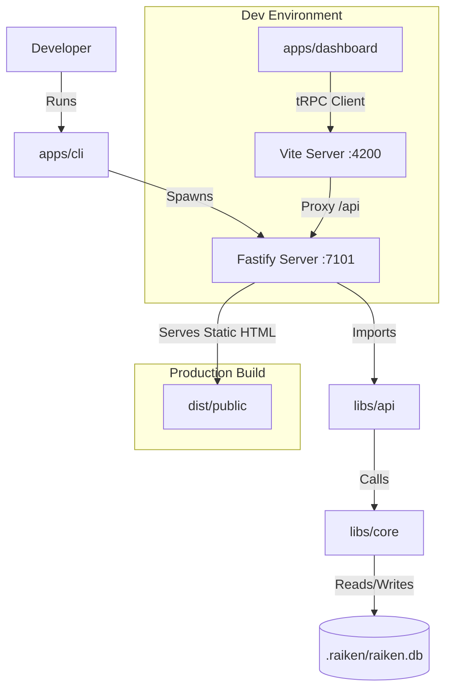

# Raiken

Raiken is a developer-centric CLI tool that automates the generation, execution, and repair of End-to-End (E2E) tests. Unlike stateless AI wrappers, Raiken maintains local state using a SQLite database to understand project evolution over time.

## 🏗 System Architecture

Raiken is built as an **Nx Integrated Monorepo**. It separates the "Runner" (CLI) from the "Logic" (Core) and the "Interface" (Dashboard).

### The 4 Pillars

| **Module**             | **Location**     | **Description**                                                   | **Tech Stack**                        |
| :--------------------- | :--------------- | :---------------------------------------------------------------- | :------------------------------------ |
| **CLI (The Runner)**   | `apps/cli`       | The Node.js binary. Spawns the server and orchestrates the agent. | Fastify, Commander, Node.js           |
| **Dashboard (The UI)** | `apps/dashboard` | The visual interface. Communicates with CLI via tRPC.             | React, Vite, Tailwind, TanStack Query |
| **Core (The Logic)**   | `libs/core`      | The "Brain". Handles DB, AST parsing, and Embeddings.             | SQLite-vec, Transformers.js, Babel    |
| **API (The Contract)** | `libs/api`       | Shared tRPC Router & Types. Ensures Type Safety between CLI & UI. | tRPC, Zod                             |

### Data Flow Diagram

