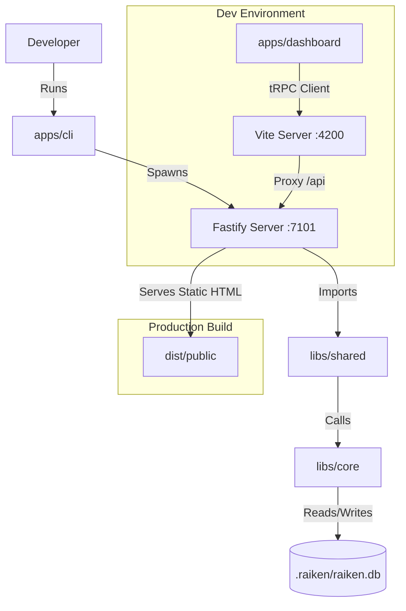

# Raiken

Raiken is a developer-centric CLI tool that automates the generation, execution, and repair of End-to-End (E2E) tests. Unlike stateless AI wrappers, Raiken maintains local state using a SQLite database to understand project evolution over time.

## 🏗 System Architecture

Raiken is built as an **Nx Integrated Monorepo**. It separates the "Runner" (CLI) from the "Logic" (Core) and the "Interface" (Dashboard).

### The 4 Pillars

| **Module**             | **Location**     | **Description**                                                   | **Tech Stack**                        |
| :--------------------- | :--------------- | :---------------------------------------------------------------- | :------------------------------------ |
| **CLI (The Runner)**   | `apps/cli`       | The Node.js binary. Spawns the server and orchestrates the agent. | Fastify, Commander, Node.js           |
| **Dashboard (The UI)** | `apps/dashboard` | The visual interface. Communicates with CLI via tRPC.             | React, Vite, Tailwind, TanStack Query |
| **Core (The Logic)**   | `libs/core`      | The "Brain". Handles DB, AST parsing, and Embeddings.             | SQLite-vec, Transformers.js, Babel    |
| **Shared (The Contract)** | `libs/shared` | Shared tRPC Router & Types. Ensures Type Safety between CLI & UI. | tRPC, Zod                             |

### Data Flow Diagram



## 🚀 Getting Started

### Prerequisites

- **Node.js**: v22.x (see `.nvmrc`)
- **pnpm**: v10.x (see root `packageManager`; install with `corepack enable`)

### Installation

1. **Clone the repository**
   ```bash
   git clone https://github.com/Raiken-Foundation/raiken-app.git
   cd raiken-app
   ```

2. **Install dependencies**
   ```bash
   pnpm install
   ```

   This will install all dependencies for the monorepo, including:
   - Root workspace dependencies
   - CLI app dependencies (`apps/cli`)
   - Dashboard app dependencies (`apps/dashboard`)
   - All library dependencies (`libs/*`)

### Running the Project

#### Development Mode (Recommended)

> **Important:** During development, you MUST run both servers. The CLI serves the API, and Vite serves the dashboard with hot reload. In production, the CLI serves everything.

Run the backend and frontend in **two separate terminals**:

**Terminal 1 - Backend (Fastify Server)**
```bash
nx serve cli
```
- Starts Fastify server on `http://localhost:7101`
- Serves tRPC API at `/api/trpc`
- Rebuild/restart the CLI after backend changes; the current server target does not watch files

**Terminal 2 - Frontend (React Dashboard)**
```bash
nx serve dashboard
```
- Starts Vite dev server on `http://localhost:4200`
- Proxies `/api` requests to backend (port 7101)
- Hot Module Replacement (HMR) enabled
- **Open your browser to `http://localhost:4200`**

#### Production Build

1. **Build all projects**
   ```bash
   nx run-many -t build
   ```

2. **Build CLI only** (includes dashboard as static assets)
   ```bash
   nx build cli
   ```

3. **Install the built CLI globally**
   ```bash
   pnpm run cli:install
   ```
   The build installs production dependencies into the distribution directory;
   this command then links that packaged CLI globally through pnpm.

4. **Run the built CLI**
   ```bash
   node dist/apps/cli/bin.cjs start
   ```
   - Serves both API and dashboard on `http://localhost:7101`

### CLI Command Reference

After installing and building Raiken, the full command surface is available (every command also supports `--help`):

#### Interactive agent & sessions

```bash
raiken -p "test the login flow"  # One-shot agent request (drives a live browser)
  --json                       # Machine-readable result
  --stream-json                # NDJSON events (start/tool/text/done)
  --run                        # Run the generated test; exit code = pass/fail
  --no-save                    # Don't persist the generated test
  --headed  --timeout <ms>

raiken sessions [--json]       # List saved sessions (one-shot runs are saved automatically)
```

#### Setup

```bash
raiken start [-p <port>] [--remote]            # Dashboard & agent server (default :7101)
raiken init [-f] [-y] [--skip-browsers]        # Initialize Raiken in the current project
raiken config [provider-or-key] [options]      # AI provider/key/model wizard (or flags)
  --provider <id>  --api-key <key>  --model <id>  --base-url <url>
  --unset-key  --list  --json
```

#### Running & repairing tests

```bash
raiken test [file]             # Run the Playwright suite (or one spec); exit code = pass/fail
  --grep <pattern>             # Only tests whose title matches (Playwright -g)
  --workers <n>  --project <name>  --retries <n>
  --headed                     # Visible browser windows
  --debug                      # Step through in the Playwright inspector
  --update-snapshots
  --list                       # List tests without running them
  --watch                      # Re-run on every project change until Ctrl+C
  --only-flaky                 # Run only quarantined specs (see quarantine.testFiles)
  --fix                        # After a failure, run the AI repair flow
  --json

raiken repair [file]           # AI-repair a failing spec: run it, show fix as diff, write on confirm
  --apply                      # Write without prompting (scripts / CI)
  --json                       # Machine-readable outcome (diff included when not applied)
  --no-interpret               # Skip the diagnosis step

raiken report [file]           # HTML/Markdown/JSON report with screenshots
  --from <json>  --format <formats>  --output <dir>  --open  --no-embed-screenshots  --json

raiken show-trace [path]       # Open a Playwright trace.zip (newest when omitted)

raiken cover <target>          # Draft a Playwright test from an AC, symbol, or free text
  -t, --ticket <id>  -o, --output <path>  --dir <path>  --dry-run  --json
  --allow-ungrounded  --fix-config

raiken doctor                  # Environment checks + flake anti-pattern lint
  --dir <path>  --fail-on <error|warning|info>  --fix  --json

raiken eval <suite> [target]   # Eval harness: playground | benchmark | flakiness <spec>
  --runs <n>  --expect-tests <n>  --repeat <n>  --out <path>  --json

```

Quarantining flaky specs: add them to `raiken.config.json` and they are skipped by default:

```json
{ "quarantine": { "testFiles": ["e2e/legacy-checkout.spec.ts"] } }
```

#### CI & change analysis

```bash
raiken ci                      # Impact analysis + affected tests + JUnit/JSON reports
  --base <ref>  --head <ref>  --staged  --output-dir <path>  --format <junit|json|both>
  --confidence <n>  --max-tests <n>  --timeout <ms>  --skip-run  --json

raiken trace [stackTrace]      # Map a stack trace to the tests most likely to reproduce it
  -f, --file <path>  --min-confidence <n>  --limit <n>  --json

raiken sync [-t <ticket>]      # Sync with the ticket system and analyze test impact
raiken context                 # Write raiken.ctx.md (project snapshot for IDE AI agents)
  --output <path>  --max-rows <n>  --no-impact  --json

```

#### Project intelligence & discovery

```bash
raiken status [--json]         # Project setup at a glance
raiken index [--force]                    # Build the code graph / keyword search index
raiken search <query> [--limit <n>] [--json]   # Keyword code search over the code graph

raiken discover [url]          # Autonomously discover web application structure
  --max-pages <n>  --max-depth <n>  --timeout <ms>
  --auth  --skip-auth  --continue  --status

raiken knowledge|kb [section] [arg] [--limit <n>] [--json] [-f]
                               # Inspect discovered site knowledge (pages, links, blockers)
raiken memory [show|clear] [--all] [--json] [-f]  # What the agent has learned about this project
                               # (--all includes run/session state; default is durable only)

raiken auth                    # Log in, save the session, and crawl the app behind it
  --url <url>  --script <path>  --manual  --headed  --timeout <ms>
  --cookie <pairs> --domain <host>  --storage <k=v>  --from-state-file <path>
  --write-login-script  --no-discover
```

Cold-start habit for grounded drafts: keep the app running at Playwright
`baseURL`, run `raiken doctor --fix` if `testMatch` is narrow, then
`raiken discover` (and `raiken auth` for anything behind a login) before
expecting cover drafts to assert real UI. `raiken cover` auto-discovers when
knowledge is empty and a seed URL is known.

Drafts are grounded in *crawled pages*, so a saved session teaches Raiken
nothing until something is crawled with it — which is why `raiken auth` ends by
crawling the app itself (`--no-discover` opts out). Until pages from behind the
login exist, cover flags post-login scenarios as unverified after sign-in, and
says so even when an `auth-state.json` is already on disk. Unverified drafts
are stamped `// @raiken-unverified`, and `raiken test` refuses to run them
(exit 1) unless `--allow-unverified` is passed — review the spec and remove
the marker once it is grounded.

Exit codes are scriptable: `0` success, `1` runtime/test failure, `2` usage error, `3` config/auth error, `4` busy conflict, `130` cancelled.

### Configuration

Raiken is configured via `raiken.config.json` in your project root (created by `raiken init`). All fields are optional.

```json
{
  "projectType": "react",
  "testDirectory": "e2e",
  "playwrightConfig": "playwright.config.ts",
  "ai": {
    "provider": "openrouter",
    "model": "anthropic/claude-sonnet-4.5",
    "baseURL": "https://openrouter.ai/api/v1",
    "maxTokens": 4000,
    "temperature": 0.7
  },
  "auth": {
    "storageStatePath": ".raiken/auth-state.json",
    "baseUrl": "http://localhost:3000",
    "loginPath": "/login",
    "customLoginScript": "e2e/auth/login.ts",
    "credentials": {
      "usernameEnv": "E2E_USERNAME",
      "passwordEnv": "E2E_PASSWORD"
    }
  },
  "browser": {
    "defaultBrowser": "chromium",
    "headless": true,
    "timeout": 30000,
    "retries": 1
  },
  "features": {
    "video": true,
    "screenshots": true,
    "tracing": false,
    "network": true
  },
  "autonomy": {
    "autoSaveTests": false,
    "autoRunTests": false,
    "autoCorrect": "suggest",
    "autoLearn": "confirm",
    "maxRetries": 2
  },
  "discovery": {
    "maxPages": 100,
    "maxDepth": 5,
    "maxConcurrency": 3,
    "timeout": 30000,
    "excludePatterns": ["/logout", "/api/"],
    "pauseOnAuth": true
  },
  "indexing": {
    "fullScan": false
  },
  "quarantine": {
    "testFiles": []
  }
}
```

`quarantine.testFiles` holds flaky specs (project-relative paths) that `raiken test` skips by
default; run them explicitly with `raiken test --only-flaky`.

The API key can also be set via the `OPENROUTER_API_KEY` environment variable (recommended) or in a `.env` file in your project root.

When `auth.customLoginScript` is configured, `raiken auth` runs it through the project's Playwright
installation and saves the resulting context to `storageStatePath`. The script must default-export
an async function receiving `{ page, context, credentials }`. Credentials are resolved from the
named environment variables and are never written into generated specs. Use `raiken auth --manual`
to force the interactive fallback.

### Development Commands

```bash
nx serve cli              # Run CLI backend (Fastify on :7101)
nx serve dashboard        # Run React dashboard (Vite on :4200)
```

#### Building
```bash
nx build cli              # Build CLI (includes dashboard as static assets)
nx build dashboard        # Build dashboard only
nx run-many -t build      # Build all projects
```

### Testing

```bash
pnpm test                 # Unit suites; no browser installation needed
pnpm test:trust           # Deterministic assertion, prompt-role, and failure regressions
pnpm exec playwright install chromium
pnpm exec nx run @raiken/playground-notes:build
pnpm test:integration     # Serialized browser integration, including repair on a mutated page
pnpm verify               # Static, unit, browser, build, and repeated golden-suite gates
```

The trust suite checks acceptance and failure contracts with deterministic responses. Live-model
quality and prompt-injection resistance require separate repeated provider evaluations; a passing
handwritten golden suite does not establish generated-test accuracy. See the
[remediation record](docs/system-remediation-2026-09-08.md) for evidence and limits.

#### Manual Discovery Testing (Recommended)

Use this runbook to manually validate discovery, auth pause/resume, and dashboard runtime behavior.

Start the stack in three terminals:

**Terminal 1 - CLI backend + embedded UI**
```bash
pnpm nx serve cli
```
- API/UI available at `http://localhost:7101`

**Terminal 2 - Dashboard dev app**
```bash
pnpm nx serve dashboard
```
- Dashboard available at `http://localhost:4200`

**Terminal 3 - Notes fixture target app**
```bash
cd tools/playground-notes
npm run dev -- --port 5173
```
- Notes fixture available at `http://localhost:5173`

Quick health check:
```bash
curl -s -o /dev/null -w "%{http_code}\n" http://localhost:7101
curl -s -o /dev/null -w "%{http_code}\n" http://localhost:4200
curl -s -o /dev/null -w "%{http_code}\n" http://localhost:5173
```
All three should return `200`.

Smoke-test sequence:
```bash
# From repo root
cd tools/playground-notes
raiken init

# Start discovery against the notes fixture
raiken discover http://localhost:5173 --max-pages 20 --max-depth 5
```

If discovery pauses on authentication:
```bash
cd tools/playground-notes
raiken auth --url http://localhost:5173/login
raiken discover --continue
```

Useful verification commands:
```bash
cd tools/playground-notes
raiken discover --status
```

You can also validate runtime in the dashboard (`http://localhost:4200`) via:
- Discovery view (Start / Continue / Clear)
- Runtime phase and counters
- Timeline and unresolved blocker panels

Stop all servers with `Ctrl+C` in each terminal.

#### Integration Test (Notes fixture)
```bash
# Build the CLI and install its runtime deps (pnpm)
pnpm run cli:deploy

# Start the CLI in the notes fixture
cd tools/playground-notes
node ../../dist/apps/cli/bin.cjs start -p 7101
```

#### Distribution smoke test
Cross-platform smoke script (version + health endpoint) for the built artifact:
```bash
pnpm run cli:deploy
pnpm smoke:cli
```

Verify the server is healthy:
```bash
curl -s http://localhost:7101/api/trpc/getHealth
```

Build the code graph (full scan):
```bash
curl -X POST http://localhost:7101/api/trpc/buildCodeGraph \
  -H "Content-Type: application/json" \
  -d '{"path":"."}'
```

Run Playwright tests from the notes fixture if needed:
```bash
npx playwright test
```

#### Code Quality
```bash
pnpm lint                 # Lint entire codebase (Biome)
pnpm format               # Format entire codebase (Biome)
pnpm check                # Run all Biome checks
nx lint <project>         # Lint specific project
```

#### CI
GitHub Actions (`.github/workflows/ci.yml`) runs on every push and pull request:

- **static-checks** — Biome, TypeScript, unit tests, CLI build
- **discovery-integration** — serialized Playwright-backed discovery integration specs (`pnpm test:integration`)
- **accuracy-gates** — deterministic trust checks and the golden suite repeated with retries disabled
- **cli-smoke** — builds the CLI on Ubuntu and runs `pnpm smoke:cli`

Release version metadata lives in `apps/cli/package.json`. The Node host reads it through `@raiken/shared/server`; the browser-safe version constant is parity-tested against the same package version. Health is composed in the split router under `libs/shared/src/lib/router/`.

### Build Errors
```bash
# Clean Nx cache
nx reset

# Rebuild all
nx run-many -t build --skip-nx-cache
```

## License

MIT
