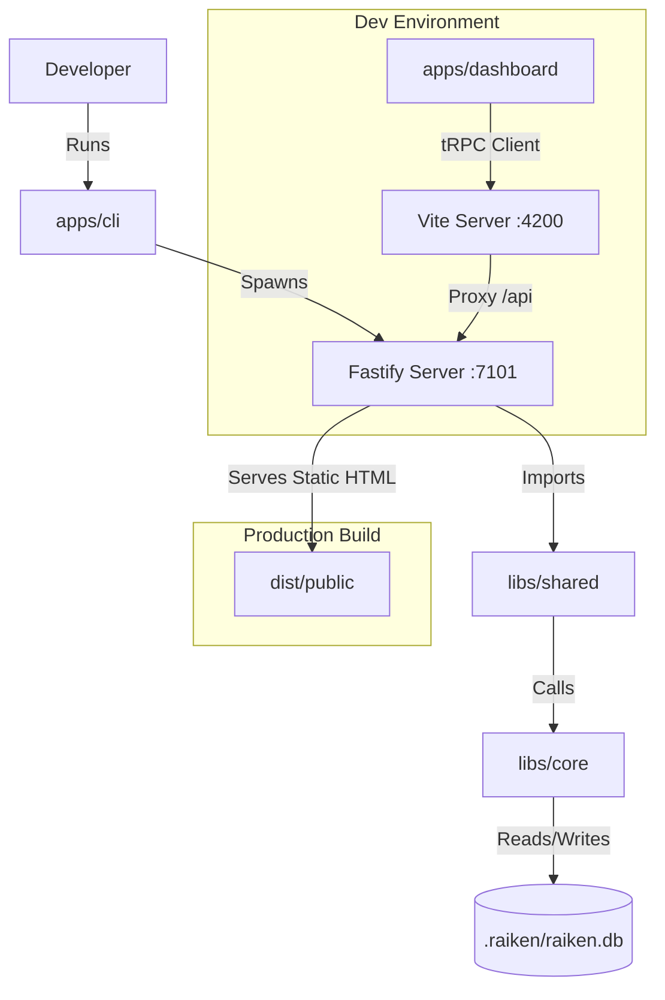

# Raiken

Raiken is a developer-centric CLI tool that automates the generation, execution, and repair of End-to-End (E2E) tests. Unlike stateless AI wrappers, Raiken maintains local state using a SQLite database to understand project evolution over time.

## 🏗 System Architecture

Raiken is built as an **Nx Integrated Monorepo**. It separates the "Runner" (CLI) from the "Logic" (Core) and the "Interface" (Dashboard).

### The 4 Pillars

| **Module**             | **Location**     | **Description**                                                   | **Tech Stack**                        |
| :--------------------- | :--------------- | :---------------------------------------------------------------- | :------------------------------------ |
| **CLI (The Runner)**   | `apps/cli`       | The Node.js binary. Spawns the server and orchestrates the agent. | Fastify, Commander, Node.js           |
| **Dashboard (The UI)** | `apps/dashboard` | The visual interface. Communicates with CLI via tRPC.             | React, Vite, Tailwind, TanStack Query |
| **Core (The Logic)**   | `libs/core`      | The "Brain". Handles DB, AST parsing, and Embeddings.             | SQLite-vec, Transformers.js, Babel    |
| **Shared (The Contract)** | `libs/shared` | Shared tRPC Router & Types. Ensures Type Safety between CLI & UI. | tRPC, Zod                             |

### Data Flow Diagram



## 🚀 Getting Started

### Prerequisites

- **Node.js**: v18 or higher
- **pnpm**: v8 or higher (install with `npm install -g pnpm`)

### Installation

1. **Clone the repository**
   ```bash
   git clone https://github.com/Raiken-Foundation/raiken-app.git
   cd raiken-app
   ```

2. **Install dependencies**
   ```bash
   pnpm install
   ```

   This will install all dependencies for the monorepo, including:
   - Root workspace dependencies
   - CLI app dependencies (`apps/cli`)
   - Dashboard app dependencies (`apps/dashboard`)
   - All library dependencies (`libs/*`)

### Running the Project

#### Development Mode (Recommended)

> **Important:** During development, you MUST run both servers. The CLI serves the API, and Vite serves the dashboard with hot reload. In production, the CLI serves everything.

Run the backend and frontend in **two separate terminals**:

**Terminal 1 - Backend (Fastify Server)**
```bash
nx serve cli
```
- Starts Fastify server on `http://localhost:7101`
- Serves tRPC API at `/api/trpc`
- Hot-reloads on code changes

**Terminal 2 - Frontend (React Dashboard)**
```bash
nx serve dashboard
```
- Starts Vite dev server on `http://localhost:4200`
- Proxies `/api` requests to backend (port 7101)
- Hot Module Replacement (HMR) enabled
- **Open your browser to `http://localhost:4200`**

#### Production Build

1. **Build all projects**
   ```bash
   nx run-many -t build
   ```

2. **Build CLI only** (includes dashboard as static assets)
   ```bash
   nx build cli
   ```

3. **Install runtime deps for the built CLI**
   ```bash
   cd dist/apps/cli && npm install --legacy-peer-deps && cd ../../..
   ```

4. **Run the built CLI**
   ```bash
   node dist/apps/cli/bin.cjs start
   ```
   - Serves both API and dashboard on `http://localhost:7101`

### Available Commands

#### Development
```bash
nx serve cli              # Run CLI backend (Fastify on :7101)
nx serve dashboard        # Run React dashboard (Vite on :4200)
```

#### Building
```bash
nx build cli              # Build CLI (includes dashboard as static assets)
nx build dashboard        # Build dashboard only
nx run-many -t build      # Build all projects
```

### Testing

#### Integration Test (Playground)
```bash
# Build the CLI
nx build cli

# Install runtime deps for the built CLI
cd dist/apps/cli && npm install --legacy-peer-deps && cd ../../..

# Start the CLI in the playground
cd tools/playground
node ../../dist/apps/cli/bin.cjs start -p 7101
```

Verify the server is healthy:
```bash
curl -s http://localhost:7101/api/trpc/getHealth
```

Build the code graph (full scan):
```bash
curl -X POST http://localhost:7101/api/trpc/buildCodeGraph \
  -H "Content-Type: application/json" \
  -d '{"path":"."}'
```

Run Playwright tests from the playground if needed:
```bash
npx playwright test
```

#### Code Quality
```bash
pnpm lint                 # Lint entire codebase (Biome)
pnpm format               # Format entire codebase (Biome)
pnpm check                # Run all Biome checks
nx lint <project>         # Lint specific project
```

### Build Errors
```bash
# Clean Nx cache
nx reset

# Rebuild all
nx run-many -t build --skip-nx-cache
```

## License

MIT
