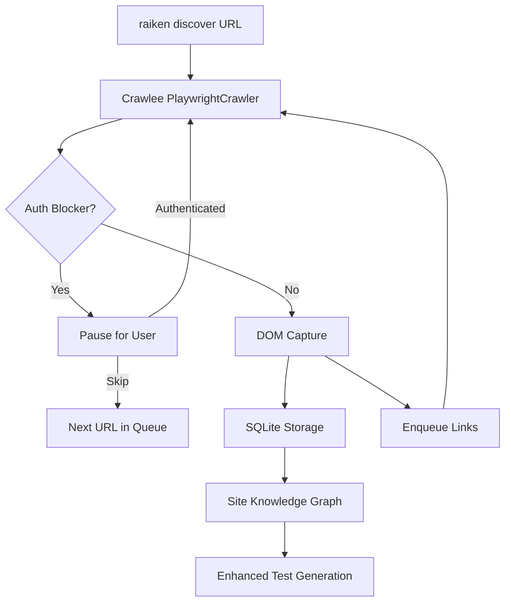

# Feature: Autonomous DOM Traversal and Site Discovery

> **Status:** Planned  
> **Priority:** High  
> **Complexity:** High  
> **Dependencies:** Crawlee, Playwright, SQLite persistence, HITL infrastructure

---

## Executive Summary

Enable Raiken to autonomously crawl and map web applications, building a **Site Knowledge Graph** that combines runtime DOM knowledge with static code understanding. The system visits every reachable page, captures DOM context, tracks navigation paths, detects authentication blockers, and pauses for human input when needed. This accumulated knowledge enables significantly better test generation with verified selectors and known navigation flows.

---

## Problem Statement

### Current Limitations

1. **Single-page capture is insufficient** - E2E tests span multiple pages, but current DOM capture only sees one page at a time
2. **Navigation paths are unknown** - The AI guesses how to reach components instead of knowing verified paths
3. **Auth blocks discovery** - Protected routes cannot be explored without handling authentication
4. **Manual URL entry is tedious** - Users must specify every URL they want to test
5. **Broken links go undetected** - No systematic way to find navigation failures

### Impact

- Tests fail because selectors don't match real DOM
- Generated tests use wrong navigation sequences
- Auth-protected features are untestable without manual intervention
- Test coverage gaps in multi-page flows

---

## Solution: Autonomous Site Discovery

Build a Crawlee-based crawler that autonomously traverses the application, captures DOM context from every page, and persists this knowledge for test generation.

### Core Principles

| Principle | Description |
|-----------|-------------|
| **Autonomous** | Crawls without user intervention until blocked |
| **HITL on blockers** | Pauses only when auth or errors require user input |
| **Exhaustive** | Clicks every link to discover all reachable pages |
| **Persistent** | Stores all discovered pages and links in SQLite |
| **Resumable** | Can continue after authentication or interruption |
| **Integrated** | Feeds knowledge directly into test generation |

---

## Architecture

### System Flow



### Component Stack

```
┌─────────────────────────────────────────────────────────────┐
│                     raiken discover                          │
├─────────────────────────────────────────────────────────────┤
│  ┌─────────────────┐  ┌─────────────────┐  ┌─────────────┐ │
│  │  Auth Detector  │  │   HITL Pausing  │  │   Storage   │ │
│  │  (custom logic) │  │  (event-based)  │  │  (SQLite)   │ │
│  └─────────────────┘  └─────────────────┘  └─────────────┘ │
├─────────────────────────────────────────────────────────────┤
│              Crawlee PlaywrightCrawler                       │
│  (queue management, parallelism, retries, deduplication)     │
├─────────────────────────────────────────────────────────────┤
│                      Playwright                              │
│              (browser automation)                            │
└─────────────────────────────────────────────────────────────┘
```

### Core Components

| Component | Location | Purpose |
|-----------|----------|---------|
| `SiteDiscovery` | `libs/core/src/site-discovery/crawler.ts` | Main crawler orchestration with Crawlee |
| `AuthDetector` | `libs/core/src/site-discovery/auth-detector.ts` | Detects login pages and auth blockers |
| `SiteKnowledgeDB` | `libs/core/src/site-discovery/db.ts` | SQLite persistence for discovered data |
| `captureFromPage` | `libs/core/src/browser/dom-capture.ts` | DOM extraction from existing Playwright page |
| Discovery CLI | `apps/cli/src/commands/discover.ts` | CLI command implementation |
| Auth CLI | `apps/cli/src/commands/auth.ts` | Manual authentication command |

---

## Data Flow

### Per-Page Processing

```
1. Dequeue URL from Crawlee queue
                │
                ▼
2. Navigate to URL (Playwright)
                │
                ▼
3. Detect auth blocker ──────────┐
   │                             │
   │ No blocker                  │ Blocker detected
   ▼                             ▼
4. Capture DOM context      5. Pause crawler
   │                             │
   ▼                             ▼
6. Save page to SQLite      7. Emit HITL event
   │                             │
   ▼                             ▼
8. Extract clickable        8. Wait for user action
   elements                      │
   │                             │
   ▼                             ▼
9. Enqueue new URLs         9. Resume/Skip/Cancel
   │                             │
   └──────────────┬──────────────┘
                  │
                  ▼
           10. Next URL
```

### Discovery Session Lifecycle

```
┌─────────────┐
│   IDLE      │
└──────┬──────┘
       │ discover(url)
       ▼
┌─────────────┐     auth blocker     ┌─────────────┐
│   RUNNING   │─────────────────────▶│   BLOCKED   │
└──────┬──────┘                      └──────┬──────┘
       │                                    │
       │ queue empty                        │ resume/skip
       ▼                                    │
┌─────────────┐                             │
│  COMPLETED  │◀────────────────────────────┘
└─────────────┘
```

---

## Database Schema

### New Tables (Schema Version 4+)

```sql
-- Pages discovered during crawling
CREATE TABLE IF NOT EXISTS discovered_pages (
  id INTEGER PRIMARY KEY AUTOINCREMENT,
  url TEXT NOT NULL UNIQUE,
  normalized_url TEXT NOT NULL,
  title TEXT,
  snapshot_json TEXT,                 -- Full DOMContext as JSON
  parent_url TEXT,                    -- Navigation source
  navigation_action TEXT,             -- "clicked 'Settings'"
  depth INTEGER DEFAULT 0,            -- Distance from start URL
  discovered_at INTEGER NOT NULL,
  last_visited_at INTEGER,
  visit_count INTEGER DEFAULT 1,
  FOREIGN KEY (parent_url) REFERENCES discovered_pages(url)
);

-- Links between pages (navigation graph)
CREATE TABLE IF NOT EXISTS discovered_links (
  id INTEGER PRIMARY KEY AUTOINCREMENT,
  from_url TEXT NOT NULL,
  to_url TEXT NOT NULL,
  selector TEXT,                      -- Playwright selector
  link_text TEXT,                     -- "Settings", "Login"
  element_role TEXT,                  -- "button", "link"
  status TEXT DEFAULT 'pending',      -- working/broken/auth_required/pending
  error_message TEXT,
  discovered_at INTEGER NOT NULL,
  verified_at INTEGER,
  UNIQUE(from_url, to_url, selector)
);

-- Auth blockers encountered
CREATE TABLE IF NOT EXISTS auth_blockers (
  id INTEGER PRIMARY KEY AUTOINCREMENT,
  url TEXT NOT NULL,
  blocker_type TEXT,                  -- login_form/oauth/401/403/session_expired
  detected_elements TEXT,             -- JSON array of form elements
  resolved_at INTEGER,
  storage_state_path TEXT,
  discovered_at INTEGER NOT NULL
);

-- Discovery sessions (for resume support)
CREATE TABLE IF NOT EXISTS discovery_sessions (
  id INTEGER PRIMARY KEY AUTOINCREMENT,
  start_url TEXT NOT NULL,
  status TEXT DEFAULT 'running',      -- running/paused/completed/blocked
  pages_discovered INTEGER DEFAULT 0,
  links_found INTEGER DEFAULT 0,
  started_at INTEGER NOT NULL,
  completed_at INTEGER,
  blocked_at_url TEXT,
  queue_json TEXT                     -- Serialized queue for resume
);

-- Performance indexes
CREATE INDEX IF NOT EXISTS idx_pages_normalized ON discovered_pages(normalized_url);
CREATE INDEX IF NOT EXISTS idx_links_from ON discovered_links(from_url);
CREATE INDEX IF NOT EXISTS idx_links_status ON discovered_links(status);
CREATE INDEX IF NOT EXISTS idx_sessions_status ON discovery_sessions(status);
```

---

## Type Definitions

```typescript
// libs/core/src/site-discovery/types.ts

import type { DOMContext } from '../browser/dom-capture';

/** A page discovered during crawling */
export interface DiscoveredPage {
  id?: number;
  url: string;
  normalizedUrl: string;
  title: string;
  snapshot: DOMContext;
  parentUrl: string | null;
  navigationAction: string | null;
  depth: number;
  discoveredAt: number;
  lastVisitedAt: number;
  visitCount: number;
}

/** A link discovered between pages */
export interface DiscoveredLink {
  id?: number;
  fromUrl: string;
  toUrl: string;
  selector: string;
  linkText: string;
  elementRole: string;
  status: 'working' | 'broken' | 'auth_required' | 'pending' | 'skipped';
  errorMessage?: string;
  discoveredAt: number;
  verifiedAt?: number;
}

/** An authentication blocker */
export interface AuthBlocker {
  id?: number;
  url: string;
  type: 'login_form' | 'oauth' | '401' | '403' | 'session_expired';
  detectedElements: string[];
  resolvedAt?: number;
  storageStatePath?: string;
  discoveredAt: number;
}

/** A discovery session (for resume support) */
export interface DiscoverySession {
  id?: number;
  startUrl: string;
  status: 'running' | 'paused' | 'completed' | 'blocked';
  pagesDiscovered: number;
  linksFound: number;
  startedAt: number;
  completedAt?: number;
  blockedAtUrl?: string;
  queue: NavigationTarget[];
}

/** A navigation target in the queue */
export interface NavigationTarget {
  url: string;
  parentUrl: string | null;
  action: string | null;
  selector?: string;
  depth: number;
}

/** Configuration options for discovery */
export interface DiscoveryOptions {
  maxPages?: number;           // Default: 100
  maxDepth?: number;           // Default: 5
  maxConcurrency?: number;     // Default: 3
  timeout?: number;            // Per-page timeout in ms, default: 30000
  storageStatePath?: string;   // Pre-authenticated session
  includePatterns?: string[];  // URL patterns to include
  excludePatterns?: string[];  // URL patterns to exclude (default: ['/logout', '/signout'])
  pauseOnAuth?: boolean;       // Pause on auth blockers, default: true
}

/** Events emitted during discovery */
export interface DiscoveryEvent {
  type: 'started' | 'navigating' | 'page_captured' | 'link_found' |
        'link_broken' | 'auth_blocked' | 'progress' | 'paused' |
        'resumed' | 'completed' | 'error';
  timestamp: number;
  data?: unknown;
}

/** Discovery statistics */
export interface DiscoveryStats {
  pagesDiscovered: number;
  linksWorking: number;
  linksBroken: number;
  linksAuthBlocked: number;
  linksPending: number;
  authBlockersFound: number;
  elapsedMs: number;
}
```

---

## CLI Commands

### `raiken discover <url>`

Start autonomous site discovery from the given URL.

```bash
# Basic discovery
raiken discover http://localhost:3000

# With options
raiken discover http://localhost:3000 --max-pages 50 --max-depth 3

# With pre-authentication
raiken discover http://localhost:3000 --auth

# Skip auth-protected routes
raiken discover http://localhost:3000 --skip-auth
```

**Options:**

| Option | Default | Description |
|--------|---------|-------------|
| `--max-pages <n>` | 100 | Maximum pages to discover |
| `--max-depth <n>` | 5 | Maximum navigation depth |
| `--auth` | false | Open browser for manual login first |
| `--skip-auth` | false | Skip routes that require authentication |
| `--continue` | false | Resume previous discovery session |
| `--status` | false | Show discovery status and stats |

### `raiken auth [--url <login-url>]`

Open a browser for manual authentication, then save the session state.

```bash
# Open browser at default URL
raiken auth

# Open browser at specific login page
raiken auth --url http://localhost:3000/login
```

**Flow:**
1. Browser opens (not headless)
2. User logs in manually
3. User presses Enter in terminal when done
4. Session state saved to `.raiken/auth.json`
5. Subsequent discovery uses this auth state

---

## Auth Detection

### Detection Patterns

The `detectAuthBlocker` function checks multiple signals:

```typescript
async function detectAuthBlocker(page: Page): Promise<AuthBlocker | null> {
  const url = page.url();

  // 1. URL patterns
  if (/\/(login|signin|sign-in|auth|authenticate)\b/i.test(url)) {
    return extractLoginFormDetails(page, 'login_form');
  }

  // 2. Password field + login button
  const hasPasswordField = await page.locator('input[type="password"]').count() > 0;
  if (hasPasswordField) {
    const hasLoginButton = await page.locator([
      'button:has-text("Sign in")',
      'button:has-text("Log in")',
      'button:has-text("Login")',
      'input[type="submit"]',
      'button[type="submit"]',
    ].join(', ')).count() > 0;

    if (hasLoginButton) {
      return extractLoginFormDetails(page, 'login_form');
    }
  }

  // 3. OAuth buttons
  const oauthCount = await page.locator([
    'button:has-text("Sign in with Google")',
    'button:has-text("Sign in with GitHub")',
    'button:has-text("Sign in with Microsoft")',
    'button:has-text("Continue with")',
  ].join(', ')).count();

  if (oauthCount > 0) {
    return extractLoginFormDetails(page, 'oauth');
  }

  // 4. Error messages in page content
  const bodyText = await page.textContent('body') || '';
  const authPhrases = [
    'access denied',
    'unauthorized',
    'please log in',
    'please sign in',
    'session expired',
    'authentication required',
  ];

  for (const phrase of authPhrases) {
    if (bodyText.toLowerCase().includes(phrase)) {
      return {
        url,
        type: phrase.includes('expired') ? 'session_expired' : '401',
        detectedElements: [],
        discoveredAt: Date.now(),
      };
    }
  }

  return null;
}
```

### Blocker Types

| Type | Detection | Example |
|------|-----------|---------|
| `login_form` | Password field + login button | Standard login page |
| `oauth` | "Sign in with X" buttons | OAuth/SSO login |
| `401` | "Unauthorized" or "Access Denied" text | API rejection |
| `403` | "Forbidden" text | Permission denied |
| `session_expired` | "Session expired" text | Timeout |

---

## Human-in-the-Loop (HITL) Flow

### When Blocker Detected

```
┌─────────────────────────────────────────────────────────────┐
│  Auth blocker detected at http://localhost:3000/admin       │
├─────────────────────────────────────────────────────────────┤
│                                                             │
│  Type: login_form                                           │
│                                                             │
│  Elements found:                                            │
│    • text: Email                                            │
│    • password: Password                                     │
│    • button: Sign In                                        │
│                                                             │
│  Options:                                                   │
│    1. Run `raiken auth` to log in manually                  │
│    2. Provide credentials in raiken.config.json             │
│    3. Skip this route with `raiken discover --skip-auth`    │
│                                                             │
└─────────────────────────────────────────────────────────────┘
```

### User Actions

| Action | Command | Result |
|--------|---------|--------|
| Authenticate | `raiken auth` then `raiken discover --continue` | Resumes with auth state |
| Skip route | `raiken discover --continue --skip-auth` | Skips auth-blocked URLs |
| Cancel | Ctrl+C | Saves progress, exits |

---

## Integration with Test Generation

### Site Knowledge in Context

When generating tests, the agent receives accumulated site knowledge:

```typescript
// In gatherContext()
const siteKnowledge = loadSiteKnowledge(projectPath, prompt);

return {
  files,           // Code context (existing)
  projectType,     // Framework detection (existing)
  siteKnowledge,   // NEW: Runtime DOM knowledge
};
```

### Enhanced Prompt

```typescript
if (context.siteKnowledge) {
  prompt += `
[SITE KNOWLEDGE - From Live Discovery]
═══════════════════════════════════════

**Pages Discovered:** ${context.siteKnowledge.pages.length}

${context.siteKnowledge.pages.map(page => `
Page: ${page.url}
  Title: "${page.title}"
  Reached via: ${page.navigationAction || 'direct URL'}
  Elements: ${page.snapshot.interactiveElements.slice(0, 8).map(e =>
    `${e.role}:"${e.name}" → ${e.suggestedSelectors[0]}`
  ).join(', ')}
`).join('\n')}

**Verified Navigation Paths:**
${context.siteKnowledge.navigationPaths.map(path =>
  `  ${path.from} → ${path.to} via "${path.action}"`
).join('\n')}

${context.siteKnowledge.authRoutes.length > 0 ? `
**Auth-Protected Routes:**
${context.siteKnowledge.authRoutes.map(r => `  - ${r.url} (${r.type})`).join('\n')}
` : ''}

IMPORTANT: Use the verified selectors above - they are confirmed working.
`;
}
```

### Benefits for Test Generation

| Before Discovery | After Discovery |
|------------------|-----------------|
| Guessed selectors | Verified selectors from live DOM |
| Unknown navigation | Known paths between pages |
| Auth surprises | Auth requirements mapped upfront |
| Broken link failures | Broken links identified early |

---

## Configuration

### raiken.config.json

```json
{
  "discovery": {
    "maxPages": 100,
    "maxDepth": 5,
    "maxConcurrency": 3,
    "timeout": 30000,
    "excludePatterns": ["/logout", "/signout", "/api/"],
    "pauseOnAuth": true
  }
}
```

### Environment Variables

| Variable | Purpose |
|----------|---------|
| `RAIKEN_DISCOVERY_MAX_PAGES` | Override maxPages |
| `RAIKEN_DISCOVERY_HEADLESS` | Run browser headless (default: true) |

---

## Guardrails and Safety

### Limits

| Guardrail | Default | Purpose |
|-----------|---------|---------|
| Max pages | 100 | Prevent infinite crawling |
| Max depth | 5 | Limit navigation depth |
| Page timeout | 30s | Catch hung pages |
| Excluded patterns | `/logout`, `/signout` | Skip destructive routes |

### Safety Measures

1. **URL deduplication** - Crawlee handles visited URL tracking
2. **Same-domain only** - Does not follow external links by default
3. **HITL on auth** - Never attempts to bypass authentication
4. **Graceful degradation** - Continues on individual page failures
5. **Session persistence** - Can resume after interruption

### Never Performed

- Automatic form submission with guessed credentials
- Clicking "Delete" or destructive action buttons
- Following links outside the application domain
- Bypassing CAPTCHAs or bot detection

---

## Implementation Phases

### Phase 1: Foundation
- Install Crawlee dependency
- Create type definitions
- Add database schema migration (v4)
- Create `libs/core/src/site-discovery/` module structure

### Phase 2: Crawler Core
- Implement `SiteDiscovery` class with Crawlee
- Implement `AuthDetector`
- Implement `SiteKnowledgeDB` persistence
- Add event emission for progress tracking

### Phase 3: DOM Capture Refactor
- Add `captureFromPage(page: Page)` function
- Keep existing `captureDOMContext(url)` for single-page use
- Ensure both share extraction logic

### Phase 4: CLI Commands
- Add `raiken discover` command
- Add `raiken auth` command
- Implement progress display and HITL prompts

### Phase 5: Test Generation Integration
- Load site knowledge in `gatherContext()`
- Update prompt templates with site knowledge
- Add selector verification hints

### Phase 6: Polish
- Add comprehensive error handling
- Add resume from saved session
- Add discovery status command
- Write tests for discovery system

---

## Success Metrics

| Metric | Target |
|--------|--------|
| Pages discovered per minute | > 10 (with 3 concurrency) |
| Auth detection accuracy | > 95% of login pages detected |
| Link status accuracy | > 99% correct working/broken classification |
| Test selector accuracy | > 90% of selectors work first try (with discovery) |
| HITL pause rate | < 10% of discovery sessions require intervention |

---

## File Structure

```
libs/core/src/site-discovery/
├── index.ts              # Module exports
├── types.ts              # Type definitions
├── crawler.ts            # SiteDiscovery class (Crawlee-based)
├── auth-detector.ts      # Auth blocker detection
├── db.ts                 # SiteKnowledgeDB persistence
└── utils.ts              # URL normalization, helpers

apps/cli/src/commands/
├── discover.ts           # raiken discover command
└── auth.ts               # raiken auth command
```

---

## Dependencies

### New Dependencies

```bash
pnpm add crawlee -w --filter @raiken/core
```

### Existing Dependencies (no changes needed)

- `playwright` - Already installed for DOM capture
- `better-sqlite3` - Already used for persistence
- `chalk`, `ora` - Already used in CLI

---

## Related Documentation

- [FEATURE_AI_DRIVEN_DOM_CAPTURE.md](FEATURE_AI_DRIVEN_DOM_CAPTURE.md) - Goal-directed navigation (complementary feature)
- [SYSTEM_UPDATE.md](SYSTEM_UPDATE.md) - Overall system architecture

---

## Open Questions

1. **SPA state tracking** - How to handle same-URL but different state? Consider hashing visible elements.

2. **Dynamic content** - Should discovery wait for animations/lazy loading? Consider configurable wait strategies.

3. **Form interaction** - Should discovery fill forms to discover post-submission pages? Consider opt-in form exploration.

4. **Multiple auth contexts** - How to handle admin vs user roles? Consider named auth profiles.

5. **Incremental updates** - How to efficiently re-discover only changed pages? Consider content hashing.
