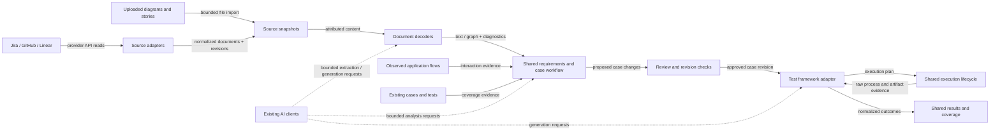

# Provider-independent requirements and testing

Status: Proposed implementation plan, 2026-09-08. No production implementation is included in this planning change.

Companion: [feature brief](requirements-to-tests.md).

## Recommendation

Build one requirements-to-tests workflow with separate adapters for external sources, document formats, and executable test frameworks. Reuse the existing AI-provider module. Keep framework-neutral test cases as durable product records, with source revisions and executable artifacts linked to them.

Use the existing CLI, dashboard, core, and local persistence. This feature does not require another service, a new agent framework, or a plugin marketplace. Start with registered built-in adapters and dependency injection.

The proposed first release prioritizes Jira/GitHub ingestion and reviewed cases, followed by diagrams and executable framework expansion. This is a planning default, not a recorded user selection. Input formats, delivery priority, and the next framework remain adjustable.

## What “provider” means here

| Extension | Owns | Must not own |
| --- | --- | --- |
| Source adapter: GitHub, Jira, existing Linear | Authentication, upstream queries, pagination decoding, source identifiers, provider-specific field/envelope mapping | Document-format parsing, requirement interpretation, case deduplication, coverage policy, test generation |
| Document decoder: structured diagram, image/PDF, rich text | Converting a document into attributed text and/or a diagram graph, with extraction diagnostics | Deciding what the application actually does, choosing a test framework |
| Test framework adapter: Playwright, proposed Cypress | Generation conventions, artifact validation, configuration, execution plan, report interpretation, framework-specific assertion semantics | Ticket fetching, requirement ownership, approvals, shared run lifecycle |
| AI provider: existing provider module | Model transport, credentials, model capabilities, request limits and cancellation | Separate Jira/Cypress/diagram business workflows |

Some implementation will differ by provider. The goal is to keep shared behavior in one place while representing real differences honestly. A provider-specific capability may require a deliberate contract extension; not every future integration can be added without any core changes.

## Current seams and gaps

| Existing implementation | Reuse | Change needed |
| --- | --- | --- |
| `integrations/types.ts`, `github-provider.ts`, `jira-provider.ts`, `linear-provider.ts` | Provider implementations and normalized ticket data | Paginated selection, stable scoped identity, source revisions, capability discovery, typed failure semantics |
| `integrations/sync.ts` | Explicit ticket and branch resolution | Inject adapter selection. Replace the assigned-item fallback with a proven branch/PR match or a visible unresolved result |
| `integrations/ticket-analyzer.ts`, `analysis/graph-query.ts` | Source/test impact evidence | Treat matches as candidate links; keep requirement and coverage decisions in the shared workflow |
| `cover/cover.ts`, `cover/intent-coverage.ts` | Acceptance-criteria entry point and existing coverage heuristics | Consume stored requirement/case revisions; retain the current CLI through a compatibility path |
| `cover/flows.ts`, `cover/flow-store.ts` | Observed navigation and auth flows | Keep separate from intended flow diagrams; observed steps may ground a case but cannot redefine it |
| `testing/test-execution-service.ts`, `runner.ts`, Playwright helpers | Execution behavior, reports, persistence | Consolidate framework selection at one interface; preserve both public callers as delegating facades during migration |
| `testing/assertion-contract.ts` | Reviewed Playwright assertion checks | Place Playwright interpretation behind its adapter; shared policy must reject unsupported repair analysis |
| `agent/ai-providers.ts`, `agent/prompt-messages.ts` | Provider clients and instruction/evidence separation | Use these from extraction and generation; record stage prompt/model/config versions |
| `workflows/workflow-store.ts`, `orchestrator/` | Existing save/run review and operation leases | Reuse execution handoff. Add a case-proposal workflow with its own state contract, rather than forcing it into `test_generate_repair` |
| `application/`, shared tRPC router, dashboard integration settings | Common application entry points | Add a requirements application interface; expose sanitized connection/capability descriptors to both UI and CLI |

Specific provider repairs belong in the first ingestion work:

- Jira currently calls `/rest/api/3/search`. Atlassian marks that endpoint deprecated and being removed; its enhanced `/rest/api/3/search/jql` interface provides `nextPageToken`. Adapt that cursor internally. [Jira issue-search reference](https://developer.atlassian.com/cloud/jira/platform/rest/v3/api-group-issue-search/)
- The existing Jira host is treated as a hostname while the dashboard suggests a full URL. Normalize and validate one base-URL representation at connection creation.
- Current assigned-ticket retrieval is bounded to the first 20 items. GitHub changed-file retrieval also stops at one page, and several failures are collapsed into empty arrays or “not found.” These cannot stand for complete backlog import.
- GitHub repository issues and GitHub Projects are distinct selection capabilities. Projects expose project items, draft issues, issue/PR content, and field values through GraphQL. Preserve project membership separately from the underlying issue identity. [GitHub Projects API guide](https://docs.github.com/en/issues/planning-and-tracking-with-projects/automating-your-project/using-the-api-to-manage-projects)

## Architecture

This diagram shows modules inside the existing application, not new deployable services.



## Shared records and invariants

The expensive decision to reverse is storing requirements as generated Playwright code or as flattened ticket strings. Stress-test the alternative with one requirement linked to both a Jira story and a diagram, implemented in two frameworks. It needs one reviewed case with independent source and artifact revisions. Therefore the proposed durable model separates these concepts:

| Record | Required meaning |
| --- | --- |
| Source | Stable external or imported document identity. Includes provider/host or tenant, kind, upstream immutable identifier, and namespace where necessary. A credential connection is not its identity |
| Source snapshot | Immutable selected content at a revision, including title, document payloads with explicit formats, source anchors, content hash, adapter mapping version, retrieval time, and upstream version when available |
| Requirement revision | Intended behavior, actors, preconditions, decisions, expected outcomes, cited source snapshots, and explicit/inferred/unresolved status |
| Test-case revision | Framework-neutral steps, data needs, expected outcomes and scope, plus proposed/approved/superseded state |
| Coverage link | A typed, evidenced relationship between requirements, cases, and executable artifacts. A semantic similarity match is only a candidate link |
| Artifact revision | Framework, project-relative path, content hash, case revision, framework/config version, and generation provenance |
| Case proposal | Create/update/review/no-change decision with explanation and the exact source, case, and artifact revisions it was based on |
| Import session | Connection and selection identity, cursor, completed pages/items, partial failures, status, and last completed synchronization checkpoint |

Invariants:

1. Source identity survives token rotation and duplicate connections to the same resource. The same GitHub issue imported through a repository and a project has one source, with two selection-membership records. A draft project item has its own identity until an explicit conversion link is observed.
2. Importing the same source revision is idempotent. Fetch time alone is not a revision. If upstream versions are insufficient, hash the relevant attributed content and preserve the normalizer version.
3. A source edit marks dependent proposals/cases stale. Renumbering an acceptance-criteria list must not silently reassign existing test identities; ambiguous lineage is reviewed.
4. Generated code is one implementation of a case. Multiple frameworks can implement the same case without copying the requirement record.
5. Requirement approval and permission to run/save tests are separate decisions. Existing Raiken operation/autonomy rules still apply.
6. Similarity, generated code, and a passing run are different kinds of evidence. Coverage reports show linkage, implementation, execution, outcome, and freshness separately.
7. Approving a proposal checks its base revisions. A newer ticket revision or an edited test produces a conflict requiring refresh, not a silent overwrite.

## Interfaces

These are draft interface shapes; implementation must add runtime schemas, fixtures, and versioning before exposing them publicly.

### Source ingestion

```ts
interface SourceAdapter {
    id: string;
    capabilities: SourceCapabilities;
    read(ref: SourceRef, context: ReadContext): Promise<SourceSnapshot>;
    scan(
        selection: SourceSelection,
        cursor: string | undefined,
        context: ReadContext,
    ): Promise<SourcePage>;
}

type SourcePage = {
    snapshots: SourceSnapshot[];
    continuation: { kind: "next"; cursor: string } | { kind: "end" };
    itemErrors: SourceItemError[];
};
```

- A registry owns adapter construction and adapter-specific connection/selection schemas. Core workflow code receives an adapter; it never constructs `JiraProvider` or branches on `provider === "github"`.
- Capability descriptors list supported selection modes and optional detail retrieval. A source without selection support reports `unsupported`; it does not pretend to return an empty backlog.
- `ReadContext` supplies resolved credentials, cancellation, a deadline, and the bounded shared HTTP transport. Credentials and authenticated URLs never enter snapshots, prompts, or browser-visible descriptors.
- Adapters own URL construction, provider query syntax, payload validation, field/envelope mapping, and cursor decoding. They retain selected document payloads with format identifiers for decoding. The shared ingestion module owns the page loop, retry budget, per-connection concurrency, idempotency, persistence, progress, and resume.
- Persist each page and its next cursor atomically. Network/model work happens outside database transactions. Only a fully successful scan advances the completed-selection checkpoint. Item errors keep the session partial even if pagination reached its end.
- If a cursor expires, restart that selection with idempotent writes. A scan interrupted by an error, limit, or cancellation cannot infer deletion. A complete accessible scan can mark membership as no longer observed; deletion requires stronger evidence than a missing/forbidden response.
- Explicit source references include the connection/scope. Ambiguous branch-to-ticket associations return choices or an unresolved result; never choose the first assigned ticket.

### Document decoding and requirement extraction

```ts
interface DocumentDecoder {
    id: string;
    version: string;
    supports(document: SourceDocument): boolean;
    decode(document: SourceDocument, context: DecodeContext): Promise<DecodedDocument>;
}
```

`DecodedDocument` contains attributed text blocks and, when applicable, nodes/edges with node kind, actors, branch labels, source locations, and uncertainty. It is not executable code. A shared extractor converts this content into proposed requirements and cases.

- Preserve rich-text lists, acceptance-criteria fields, tables, selected attachments, and diagram branch labels. Do not flatten Jira rich text or a diagram into an unstructured paragraph before retaining its structure.
- Source adapters select provider fields and preserve document formats; decoders produce common attributed blocks. For example, an ADF decoder can serve any source that supplies ADF. Adding a new ticket system must not create another rich-text parser or LLM extraction pipeline.
- Start with a documented subset of a structured flow format and image uploads. Mermaid and PNG/JPEG are proposed candidates; parser dependency and exact supported syntax require a fixture spike before commitment. PDF and draw.io can follow through the same interface.
- Image extraction uses a compatible vision model from the existing AI module. Unsupported vision, unreadable content, unknown diagram constructs, and missing expected outcomes produce visible diagnostics.
- Diagrams with cycles require a bounded scenario-selection policy: cover explicit decision branches, identify unreachable nodes, and label omitted paths. Do not claim exhaustive coverage of all possible paths.
- A user-story relationship diagram may yield requirements and clarification needs without a runnable sequence. Never invent sequencing solely from spatial arrangement.
- Treat document instructions as evidence. Schema-valid model output still requires valid source citations and review of inferred behavior.

### Test generation, execution, and repair

```ts
interface TestFrameworkAdapter {
    id: string;
    capabilities: FrameworkCapabilities;
    generationContract(input: ApprovedCaseContext): GenerationContract;
    validateArtifact(input: ArtifactInput): ArtifactValidation;
    planRun(input: RunRequest): ExecutionPlan;
    interpretRun(input: RawRunEvidence): NormalizedRun;
    assessRepair(input: RepairComparison): RepairAssessment;
}
```

- The shared testing module owns operation leases, subprocess lifetime, cancellation, time budgets, safe artifact writes, approval policy, history, and final success/failure. Both `TestRunner` and `TestExecutionService` delegate to it during migration.
- An execution plan uses executable plus argument arrays, working directory, bounded environment references, and expected artifact locations. It is not arbitrary shell text supplied by a ticket or model.
- Each adapter owns framework syntax, test collection, configuration resolution, reporter details, and assertion interpretation. Do not pass Cypress code through a checker that looks for Playwright `test()` declarations or assumes Playwright matcher chains.
- Repair assessment is `preserved`, `changed`, or `unsupported`, with evidence. The shared acceptance policy blocks automatic application for `changed` and `unsupported`. A framework can support generation/execution while repair is explicitly unavailable.
- Preserve full file/suite/test/browser/project identity, attempt/retry data, attachments, and reporter-level failures in normalized results. Raw reports remain available for diagnostics; missing fields are unknown rather than invented.
- One run request resolves one framework and one configuration. Mixed-framework projects use explicit selection when detection is ambiguous; cross-framework comparisons reference case IDs, not coincidentally equal titles.
- Browser discovery can continue using Playwright while another adapter executes tests. A diagram-defined API or unit case needs the appropriate grounding; browser observations do not establish every test layer's setup.
- Prove the execution seam with Playwright and a small Cypress implementation for the same browser behavior. Cypress supports custom reporters, so normalized results can come from a deliberate reporter contract. Confirm collection, per-spec reporting, retry and exit semantics in fixtures before broad support. [Cypress reporter documentation](https://docs.cypress.io/app/tooling/reporters)

### AI usage

Use the existing resolved provider clients rather than adding `JiraAI`, `DiagramAI`, or `CypressAI`. Own stage instructions once in extraction, case synthesis, and generation modules; framework adapters contribute only syntax/capability-specific instructions.

Record source hashes, model/provider, resolved non-secret configuration hash, prompt/schema/decoder/framework versions, and generated artifacts for each proposal. Bound input/output tokens and model calls. Structured-output fallback still undergoes runtime validation; an unavailable capability or exhausted budget produces an explicit incomplete result.

## Application and persistence placement

Proposed file ownership; names can change without changing the interfaces:

```text
libs/core/src/
  integrations/
    registry.ts                 # connection/selection resolution
    source-contract.ts          # snapshots, references, pages, capabilities
    ingest.ts                   # shared import lifecycle
    transport.ts                # bounded requests and normalized failures
    github-provider.ts          # evolve existing implementation
    jira-provider.ts
    linear-provider.ts
  requirements/
    model.ts                    # runtime schemas for requirements/cases/proposals
    extract.ts                  # shared attributed requirement extraction
    reconcile.ts                # lineage, matching, conflicts, staleness
    propose.ts                  # create/update/review case proposals
    decoders/                   # format-specific implementations
  testing/
    framework-contract.ts
    frameworks/playwright.ts    # delegates existing Playwright implementation
    frameworks/cypress.ts       # added when its first real slice is built
    execution.ts                # consolidate lifecycle already present today
  application/requirements.ts  # interface shared by CLI and tRPC
  database/repositories/requirements.repository.ts
```

Keep new records in the existing project-local database through its migration and repository mechanism. Source blobs/attachments use contained local artifact paths. The requirements repository owns these records; adapters cannot write directly to its tables. Do not introduce a second database just to separate modules.

The application interface should expose a small set of operations: import/sync sources, propose case changes, list/review proposals, retrieve coverage, and hand approved cases to existing test generation/execution. Long operations return a job ID with progress and cancellation. Persist case-proposal state independently of the existing executable-test HITL record, then hand off by IDs and revisions.

CLI commands and dashboard handlers call this same application interface. Connection setup has common controls plus adapter-specific validated fields. The browser receives labels, capabilities, and non-secret connection state; it never receives server adapter instances or credentials.

## Delivery sequence

Each step is independently reviewable. Keep the current Playwright and `cover AC-N --ticket` paths working until their replacement passes parity checks.

| Step | Scope and likely files | Done when |
| --- | --- | --- |
| 0. Contract fixtures | `integrations/__tests__/fixtures`, `requirements/model.ts`, shared contract-test helpers | Equivalent GitHub/Jira stories yield equivalent attributed requirement content; identity collisions, revisions, and partial pages are modeled. Contract review catches fields lost during normalization |
| 1. First complete user slice | Source registry/contracts, existing Jira/GitHub adapters, requirements repository/application, minimal CLI | An explicitly selected Jira or GitHub ticket produces reviewable cases through the same workflow, with citations, missing-information diagnostics, and an idempotent second import. Existing Linear and ticket commands retain behavior through compatibility adapters |
| 2. Reliable backlog synchronization | Shared ingest/transport, provider selection capabilities, dashboard connections/import progress | Repository/project selection paginates completely, survives interrupted import, exposes partial errors, and detects changed sources. GitHub Projects is an explicit capability with membership/draft-item fixtures; unsupported scopes are visible |
| 3. Existing-case improvement | Reconciliation/proposals, coverage links, dashboard review, existing impact-query integration | A requirement change proposes a focused test-case update, preserves unrelated cases, rejects stale approvals, and shows source evidence and before/after expectations |
| 4. Diagram inputs | Two decoder implementations, bounded upload/import, graph review | Structured and image versions of a fixture produce equivalent reviewed branches and outcomes through the same extractor. Ambiguous labels and unsupported structures require review; source-node/page anchors remain visible |
| 5. Executable framework seam | Testing interface/execution consolidation, Playwright adapter, existing generation/repair callers | Current Playwright behavior and trust regressions pass through the adapter without losing identity, failure semantics, cancellation, or containment. A reviewed case generates and runs with recorded traceability |
| 6. Second framework proof | Cypress adapter, paired browser fixtures, shared report UI | The same approved case runs against healthy and mutated fixtures in both frameworks; UI, case logic, ingestion, and history are unchanged. Unsupported repair modes fail explicitly. Another framework becomes an adapter task rather than a copied workflow |
| 7. Product qualification | Contract suite, repeated browser/model evals, installed CLI and dashboard journeys | End-to-end import → review → generate → run → source edit → proposed update has measured outcomes, live-provider checks, and a documented supported-capability matrix |

Steps 4 and 5 can be reordered after step 3 according to product priority. Step 6 proves the execution abstraction before declaring the product broadly multi-framework. No fixed delivery dates are assumed.

## Migration and rollback

- Add schema tables and interfaces before redirecting callers. Do not rewrite existing specs or reclassify their coverage as verified during migration.
- Translate the existing single-provider configuration into one default connection. Keep legacy settings readable; introduce multiple named connections additively.
- Preserve existing ticket exports through a compatibility facade while new code consumes `SourceSnapshot`. Keep provider enums inside registration/configuration; neutral requirements schemas do not enumerate every upstream vendor.
- Version source normalization, requirement/case records, and artifact mappings. Re-extraction under a new normalizer produces a proposal, not silent replacement of approved cases.
- Retain existing artifact names and report behavior while adapting the runner. Only remove old implementations when every call path uses the shared execution module and parity tests pass.
- New ingestion/case UI can be disabled while the legacy path remains available. Rollback does not delete imported snapshots, proposed cases, or user-authored tests. Verify older code tolerates additive schema changes against a database copy before relying on binary rollback.
- External write-back, scheduled remote workers, third-party code plugins, and automatic cross-provider requirement merging are later scope, not prerequisites for the first release.

## Verification and observability

Contract tests cross the same interfaces used by application callers. Keep provider payload fixtures at the adapter edge and use actual local persistence for lifecycle tests.

| Proof | Required cases |
| --- | --- |
| Source conformance | Multi-page import; duplicate connection/resource; same issue in repository and project; same display ID in different scopes; permission failure; invalid payload; rate limit; interrupted/expired cursor; changed source; missing item without deletion inference |
| Shared case workflow | Equivalent semantics from different sources; requirement citations; duplicate candidate review; source conflicts; branch ambiguity; repeated import; criteria reorder; optimistic revision conflict; preserved manually edited assertions |
| Decoder conformance | Structured and raster representations of the same flow; missing outcome; ambiguous branch; cycle budget; unreachable node; story relationships without ordering; injected instructions; unsupported format/model |
| Framework conformance | Pass/fail/skip/zero-tests; compile/global setup error; retries; browser projects; cancellation/process cleanup; contained artifacts; failed repair preservation; unsupported assertions; healthy-versus-mutated app |
| Complete product flow | Real account import with sanitized fixtures, case review, runnable artifact, source change, focused update proposal, and no external ticket mutation |

Use deterministic CI fixtures for contract behavior. Record repeated live-model results separately: correct requirement extraction, valid citations, bug detection, false passes, false alarms, review effort, latency, model calls, and cost. Skipped live checks are unmeasured, not passing. Do not choose numerical accuracy targets without a baseline dataset.

Each job records connection/selection IDs, imported/changed/failed counts, completion state, elapsed time, retries, stage versions, and correlation IDs. Logs use identifiers and redacted error categories; source bodies and credentials are not routine log fields. At larger backlogs, page-based persistence, bounded concurrency, unchanged-revision skipping, and batched reads prevent per-ticket model calls from becoming the default cost.

## Alternatives and trade-offs

| Option | Assessment |
| --- | --- |
| Copy a workflow per source/framework | Fast first demo; correctness fixes, prompts, retries, and UI behavior diverge. Reject |
| One universal provider interface for tickets, models, and test runners | Unrelated capabilities accumulate optional methods and conditionals. Reject |
| Shared requirements/cases with purpose-specific adapters | Chosen proposal: one durable workflow and honest provider differences; requires careful versioned contracts and adapter conformance tests |
| General external plugin platform now | Adds trust, installation, compatibility, and packaging work before two real adapters establish the interfaces. Defer |

This prioritizes maintainability, source traceability, and local operation. It accepts upfront schema/reconciliation work and conservative handling of uncertain requirements. The first slice tests the costliest assumption—one case can retain its meaning across multiple sources and execution frameworks—before committing to a broad provider catalog.
